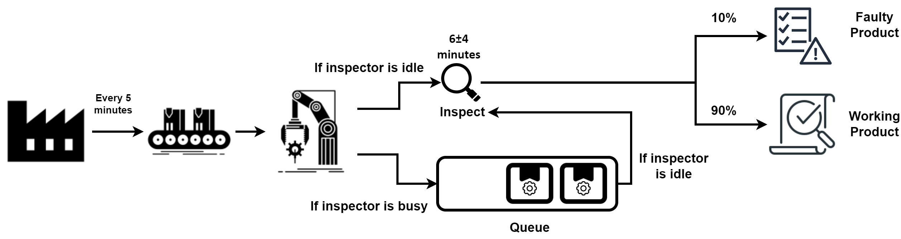

# Machine Tool Manufacturing Discrete Simulation
In this project, a simulation of a shop producing machine parts is designed.

A machine tool in a manufacturing shop is turning out parts at the rate of every 5 minutes. As they are finished, the parts are sent to an inspector who takes
$6 \pm 4$ minutes (uniform distribution) to examine each one and rejects about 10% of the parts as faulty.



If the inspector is idle, the inspector examines the tool. Otherwise, the tool is sent to queue. If a part does not reach the inspector and if there is a part
in the queue, teh inspector takes it from the queue.

Simulation is run for 100 faulty parts to leave the system.

## About Code
``` java
public void run() {
    initialize();                       // initialize the simulation
    while (!finished) {                 // the simulation continues while finished is true
        Event event = timeAdvance();    // advance the simulation clock, and return next event
        eventHandling(event);           // process teh event
    }
    report();                           // print report all statistical results
}
```

initialize() method sets the simulation clock to zero and produces initial event for teh system. The service time is calculated for the event, and it is added
to future event list (FEL).

timeAdvance() method advances the simulation clock and returns the processed next event from the fel. The event is passed to eventHandling() method.

eventHandling() method processes the passed event according to the simulation rules. In this block, types of event may be changed or generated new events.

There are 3 types of event.
1) ARRIVAL
2) IN_QUEUE
3) LEAVING

ARRIVAL means that an event with id numbered will arrive to the inspector.

IN_QUEUE means that if the inspector is busy, arrived event will be added to future event list.

LEAVING means that when the inspector starts to examine the machine tool at the startTime of event, the tool will leave the system at the endTime of event.

In this simulation, ids of event are actually ids of machine tool. Types of event are changed in the system.

### Logic of Advancing the Clock
``` java
private Event timeAdvance() {
    preClock = clock;
    Event event = fel.peek();
    if (event.eventType == EventType.ARRIVAL) {
        clock = event.arrivalTime;
    } else if (event.eventType == EventType.LEAVING) {
        clock = event.endTime;
    } else {
        clock = event.startTime;
    }
    return fel.poll();
}
```

ARRIVAL events arrive at the arrivalTime. So, the simulation clock is advanced to arrivalTime of event.

LEAVING events leave at the endTime. So, the simulation clock is advanced to endTime of event.

IN_QUEUE events arrive to the inspector again at the startTime, and the inspector starts to examine. So, the simulation clock is advanced to arrivalTime of event.

### Priority Queue for FEL
Future event list it is actually a priority queue. Because, although a tool is produced every 5 minutes, the inspection takes between 2 and 10 minutes. 
However, there are waiting in queues. As a result, when the timeAdvance method runs, it has to fetch the next event. While doing this, it should assign priority 
to the events that should come first. It does this with the time information it contains.

``` java
public int compareTo(Event other) {
    int thisCmpTime;
    int otherCmpTime;

    if (this.eventType == EventType.ARRIVAL) thisCmpTime = this.arrivalTime;
    else if (this.eventType == EventType.IN_QUEUE) thisCmpTime = this.startTime;
    else thisCmpTime = this.endTime;

    if (other.eventType == EventType.ARRIVAL) otherCmpTime = other.arrivalTime;
    else if (other.eventType == EventType.IN_QUEUE) otherCmpTime = other.startTime;
    else otherCmpTime = other.endTime;

    int priority = Integer.compare(thisCmpTime, otherCmpTime);
    return priority == 0 ? Integer.compare(other.eventType.ordinal(), this.eventType.ordinal()) : priority;
}
```

The compareTo() method, which was written for the purpose of determining the priority, assigns the times to be compared to the variables by looking at the types 
of the events and makes the priority of the event that should come first. If more than one event comes in at the same time, this time priority is assigned 
according to the types of the event. Events with type LEAVING are given top priority here. Because a tool must first leave the system so that the inspector can 
receive a tool. Second is the IN_QUEUE type. Because if there is a pending event in the queue, it must be retrieved first. The one with the lowest priority is 
the ARRIVAL type. Because if the queue is empty, it will be able to reach the inspector. Otherwise, it will already be sent to the queue.

### Report
At the end of the simulation, a report is printed. Example:

```
------------------------------
t = 6896
Inspection completed
Part 1134 is working
------------------------------
Part 1135 scheduled to leave system at t = 6902
------------------------------
------------------------------
t = 6900
Part 1379 arrived for inspection
Part 1379 goes into queue
Queue length = 244
New arrival (Part 1380) generated and scheduled for t = 6905
### Content of FEL ###
### END ###
Total simulation time = 7127
Length of FEL = 251
Average length of queue = 210.85834502103788
Maximum length of queue = 250
```